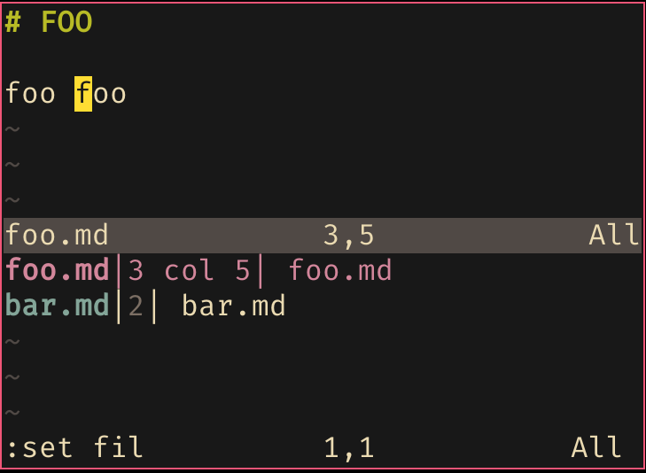

# QBuf.nvim

<p align="center">

</p>

`qbuf.nvim` is a Neovim plugin crafted in Lua, catering to traditionalists who prefer a jumplist approach over modern fuzzy finders like `fzf` or `telescope.nvim`. It aims to enhance buffer navigation by channeling the list of open buffers into the quickfix list, thus enabling more efficient buffer management and navigation within Neovim.

<!--  -->

## Features

- Enumerates all open (and listed) buffers within the quickfix window.
- Facilitates swift navigation between buffers through the quickfix list functionality.
- Seamlessly integrates with Neovim's native buffer and quickfix list commands for an intuitive user experience.

## Installation

`qbuf.nvim` can be installed using any of the popular package managers for Neovim. Here are the installation instructions for several common package managers:

### Using [lazy.nvim](https://github.com/folke/lazy.nvim)
```lua
return {
    'ayoubelmhamdi/qbuf.nvim',
    keys = {
        { '<space>b', "<cmd>lua require'qbuf'.move()<cr>" },
    },
}
```
### Using [packer.nvim](https://github.com/wbthomason/packer.nvim)
```lua
use 'ayoubelmhamdi/qbuf.nvim'
```

### Using [vim-plug](https://github.com/junegunn/vim-plug)

```vim
Plug 'ayoubelmhamdi/qbuf.nvim'
```

After adding the plugin, be sure to execute `:PlugInstall` to complete the installation process.

## Usage

`qbuf.nvim` is designed to work immediately upon installation, requiring no additional configuration. Once installed, the following command can be used to populate the quickfix list with open buffers:
```vim
:lua require'qbuf'.quickfix()
```
The native `:copen` command can then be used to display the quickfix list. Alternatively, the plugin provides a `move()` function that both generates the quickfix list and navigates to the next item using `:copen` and `:cnext` in a single step:
```vim
:lua require'qbuf'.move()
```

For convenience, this command can be bound to a key combination in your `init.vim` or `init.lua` file, as shown below:

```vim
nnoremap <space>b :lua require'qbuf'.move()<CR>
```

## License

`qbuf.nvim` is made available under the MIT License. For more details, refer to the [LICENSE](LICENSE) file.

## Contributing

We welcome contributions! If you're interested in contributing, please fork the repository and create a feature branch. We look forward to your pull requests.

## Support

Should you encounter any issues or have feature suggestions, please file an issue on the [GitHub repository](https://github.com/ayoubelmhamdi/qbuf.nvim/issues).
